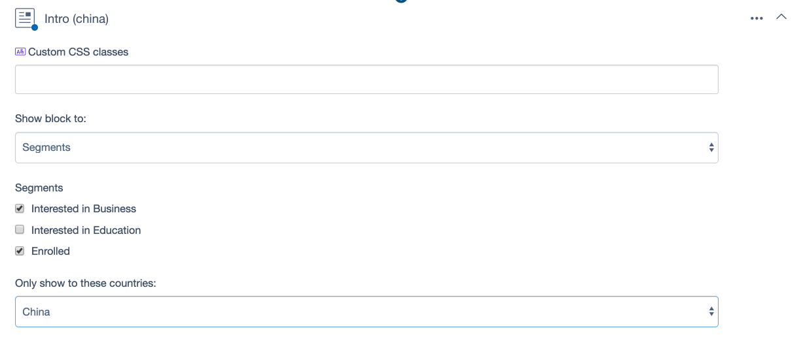
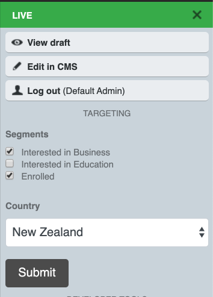

# Block Targeting Proof of Concept

## Overview

Enables targeting of blocks based on
login status, country, or user group.

This functionality is often tailored to the project,
or weaved into custom integrations with third party software
which does the heavy lifting around mapping known user attributes
to segments via a rules engine (such as segment.com).

At this stage, this module is simply a proof of concept to illustrate what's possible
when talking to customers in various context.

When used with [betternavigator](https://www.silverstripe.org/blog/betternavigator-module-for-silverstripe/),
adds country and segment settings to the navigator (only visible to logged-in authors). 

## Screenshots



Blocks UI



Better Navigator Integration

## Usage 

Block visibility is determined in the main template loop in `ElementalArea.ss`.
Depending on your [template inheritance](https://docs.silverstripe.org/en/4/developer_guides/templates/template_inheritance/)
setup, you might need to copy this template
into `app/templates` or your `themes/` folder.

## Configuration

You can enable different ways of targeting:

```yaml
Silverstripe\TargetingPoc\Config:
  use_groups: false
  use_country: true
  use_segments: true
  use_loggedin: true
```

Define some segments to show

```yaml
Silverstripe\TargetingPoc\Extensions\BaseElementExtension:
  segments:
    InterestedBusiness: Interested in Business
    InterestedEducation: Interested in Creative Arts
    InterestedHealth: Interested in Health
    InterestedHumanities: Interested in Humanities
    InterestedSciences: Interested in Sciences
    Enquired: Enquired
    Enrolled: Enrolled
```

## Known Limitations

 * Does not "group" block variations
 * Can't hide a "base block" when a variation applies. Hence targeted blocks are only additive